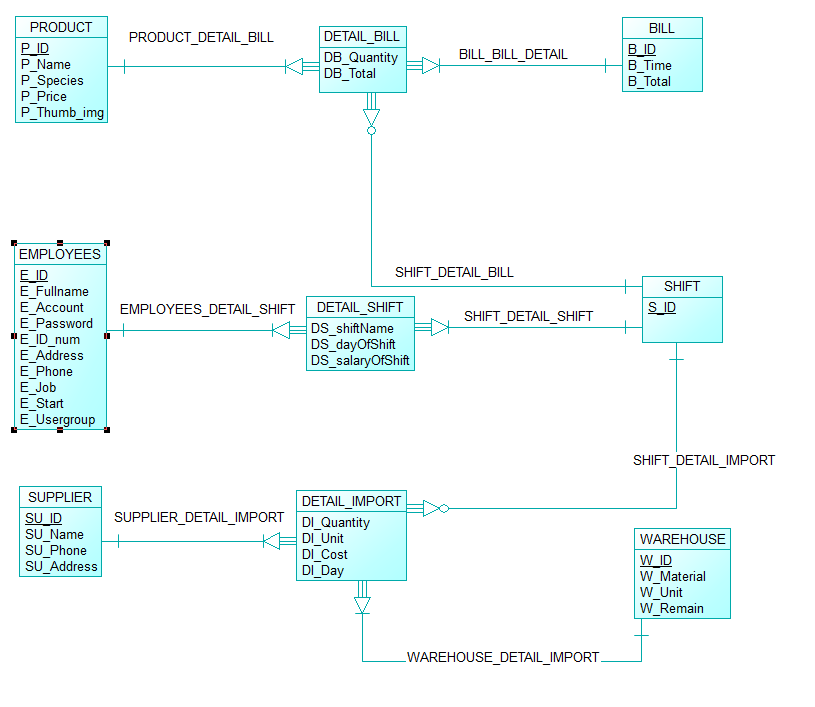
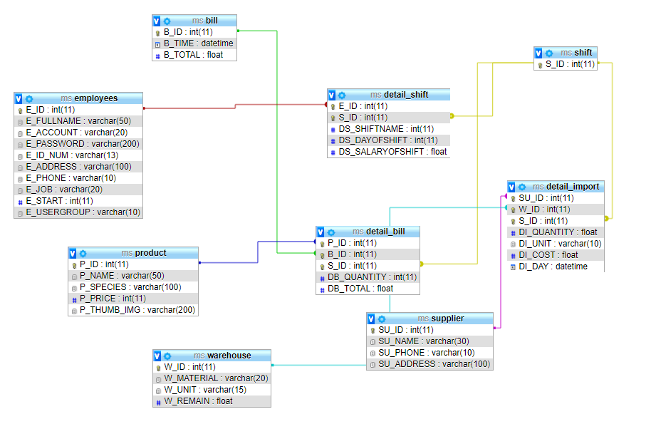

# ManagementSystem

Hệ thống web quản lý quán cafe sử dụng ngôn ngữ PHP, MySQL cho Back-end và HTML, CSS, JS cho front-end (Bootstrap Framework). 
Demo: <a href="http://www.ms.giangcse.site/">www.ms.giangcse.site</a>
<i>Lưu ý: <strong>Import (nhập) cơ sở dữ liệu ms.sql vào phpmyadmin và cấu hình lại file sql_conn.php trước khi sử dụng.</strong></i> 
Tài khoản: <strong>giangphan</strong> 
Mật khẩu: <strong>giang</strong> 
<i>Đối với các tài khoản khác thì tài khoản là tên họ viết liền không dâu, mật khẩu là tên không dấu.</i> 

Conceptual Data Model

Constraint key Design View

